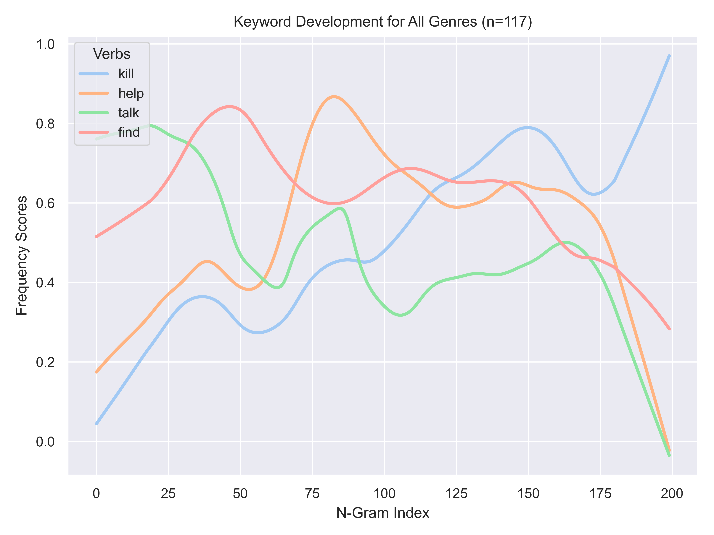
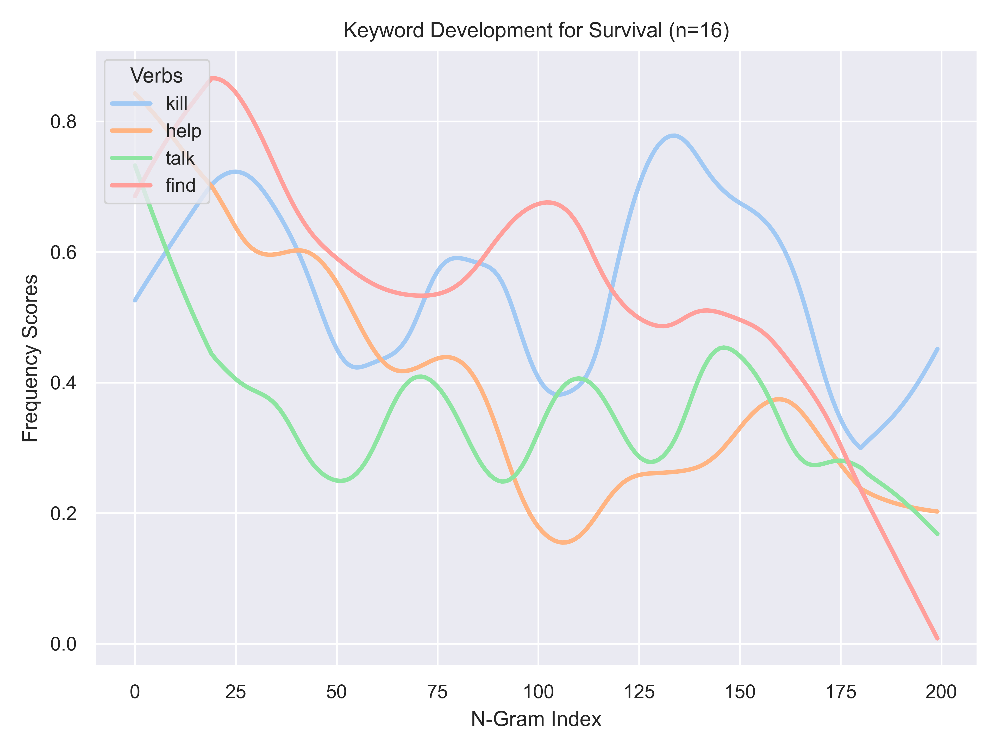

# GameStudies-ActionRequests
## What to expect in this repo
Here I investigate if there is a possibility to draw development curves of action request speech acts in video games using game transcripts from [Game Scripts Wiki](https://game-scripts-wiki.blogspot.com/) and transcribed audio using OpenAI's Whisper from Youtube videos of no commentary gameplay walkthroughs of multiple channels (currently ~10,000 hours of audio downloaded). 
Action requests aim to make the player do something, like *go*, *help*, *talk* or *find*. 
These speech acts are imperative in a sense but not in a forced way. 
They are like instructions given to the player rather than the players avatar, so they are somewhat meta-narrative while being part of the narration. 

Early results using (normalised scores to move curves closer together) show that the verb like *talk* sees a falling curve. Maybe because talking is a big part of character introduction that might be strongest in early and mid parts. 
Verbs *help* has a rising curve till the middle and then a falling curve. *Kill* has a continiously rising curve. 
Maybe because player characters usually rise in power as the game progresses and are more able to perform these tasks later then earlier. 
I also suspect these verbs differ not only in video games as a whole but also within genres. 
Survival games show falling curve for most verbs. 
Maybe because of the lower power levels of the player character in these type of games. 
So maybe there can be some general and also genre-specific findings.

(currently only for all occurrences of the tokens including all POS)

## Working title
*Analysing Changes in Prevalence of Action Request Speech Acts in Video Game Dialogues: A Computational Approach using Term Frequencies and Percentage-based Adaptive N-Grams*

## TODO:
### Data collection and preparation:
- [x] crawl and clean transcripts from [Game Scripts Wiki](https://game-scripts-wiki.blogspot.com/)
- [x] scrape audio files from YouTube channels of non-commented playthroughs like: 
  - [x] [Gamers Little Playground](https://www.youtube.com/@glp), 
  - [x] [FullPlaythroughs](https://www.youtube.com/@FullPlaythroughs), 
  - [x] [MKIceAndFire](https://www.youtube.com/@MKIceAndFire) and 
  - [x] [Shirrako](https://www.youtube.com/@Shirrako)
- [ ] combine playthroughs that consist of multiple parts
- [ ] transcribe files using OpenAI's Whisper (takes about 10% of file length in base model)
- [ ] compare model performance to find model with best trade-offs:
  - [ ] select all games that have a transcript on [Game Scripts Wiki](https://game-scripts-wiki.blogspot.com/)
  - [ ] create Whisper transcripts of these games audios for each Whisper model
  - [ ] preprocess and vectorize texts and use cosine similarity to compare, accounting for changes in text order for non-linear games
  - [ ] choose highest performing model that still has reasonable processing time
- [ ] merge transcripts that were covered in more than one channel?
- [ ] genre-tag transcripts (using Steam user-generated tags?)
- [ ] merge into transcripts of [Game Scripts Wiki](https://game-scripts-wiki.blogspot.com/)

### Processing and analysis:
- [x] use word-level n-grams of variable sizes
- [x] calculate keyword importance for every n-gram using term frequency
- [x] plot relative importance for every keyword for all games and by genre
- [ ] expand analysis to all verbs instead of chosen verbs to avoid bias
- [ ] change preprocessing to only include verbs used in imperative fashion in tf value calculation
- [ ] cluster verbs into synonyms (using cosine similarity on spaCy vectors?)
- [ ] calculate ANOVA or other tests to check for significant differences between genres

### Stuff for later
train classifier models:
- [ ] treat term frequencies over n-grams as time series
- [ ] train classifiers with time series data to predict genre

for comparison do the whole process of the project also with:
- [ ] Literature (Novels)
- [ ] Movies/Series

## Current challenges
- How to detect action request speech acts in NLP? Probably not feasible in a paper of this scope. Maybe just use contexts of imperative mood?
- How to deal with compound verbs in cases like 'I need help!'? This should be considered a synoym to 'Help me!', but a POS tagging approach would exclude this.
- How to account for uneven class distribution? Action adventure is the dominant class with much higher distribution than other genres. Maybe prune this class and raise other genres using SMOTE?
- Should I use the mean curves as a baseline? If the curve for 'kill' is rising in all genres, this way I could see if the curve is rising even stronger in shooter games. Maybe create a residual matrix to see the curves corrected for baseline and perform Monte Carlo Tests for significance testing.
- How to deal with Whisper's hallucinations? Segments keep randomly repeating. Can usually be fixed in postprocessing in cases of full repetition but how to deal with cases like this?
  - [01:40:11.380 --> 01:40:13.380]  Oh, that's a good one!
  - [01:40:13.380 --> 01:40:15.380]  Oh, that was a good one.
- How to merge documents that were covered by more than one channel? Optimally, transcripts of different channels have different errors and artifacts that will be reduced or even balanced out by merging. But how to calculate something like the mean of a document? Maybe treat them as individual games till the end and then get the mean of their TF-IDF scores?
