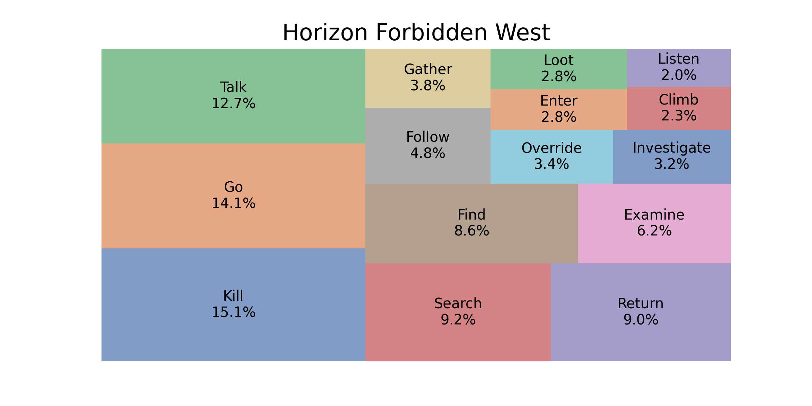

# GameStudies-ActionRequests
## TL;DR
- I want to write a thesis on directive speech acts in video games
- Directive speech acts are commands, requests, sugestions and similar
- In video games, they are somewhat meta-narrative because they are targeted more towards the player than the players avatar
- I want to know how the prevalence of different verbs in directive speech acts changes over time and among genres (do you *talk* more in an RPG and *kill* more in a shooter?)
- For that I can use either game audio transcripts gathered from YouTube playthroughs or quest objective data from various game wikis
- Directive speech acts can be identified using NLP methods or LLMs as zero-shot classifiers
- If there is still time left, I would like to try creating time series of directive speech act verb distributions and use that for genre classifier training
## What to expect in this repo
Here I investigate the possibility to draw prevalence curves of directive speech acts in video games.
Directive speech acts aim to make the player do something, like *go*, *help*, *talk* or *find*. 
These speech acts can take the form of imperatives or direct commands like *Help me!* and also more indirect forms or implied requests like *I need help!* or *Could someone help me?*. 
In video games those speech acts are particularly interesting compared to their occurrances in films or texts, because in a sense they are instructions given to the player rather than the players ingame character, so they are somewhat meta-narrative while still being part of the games narration. 

## Theoretical background
J. L. Austin established the idea of speech acts in his work *How to do Things with Words?* in 1962.
The basic principle of a speech act is, that linguistic utterances can be considered actions and have the ability to e.g. assert truth or change reality. 
He distinguishes three main types of speech acts:
1. Locutionary act:
    - used for expression of thoughts
    - sentence elements have their regular meaning
    - e.g. *I like ducks.*
2. Illocutionary act:
    - core of Austin's theory
    - reveal an intention behind an utterance
    - has subtypes:
      - Assertive: *I declare the meeting open.*
      - Directive: *Please feed the cats.*
      - Commissive: *I promise to do it tomorrow.*
      - Expressive: *I apologize for being late.*
      - Declarative: *I hereby name this ship Boaty McBoatface.*
3. Perlocutionary act:
    - have (psychological) effects on the listener and change their state
    - e.g. making someone laugh by telling something funny

Directive speech acts are characterized by the expression of the speaker for the listener to do something and can take different forms like commands, (polite/impolite/casual) requests, hints or many other. 
They can take a multitude of grammatical forms and especially indirect requests can be hard to understand for humans, making them even more difficult to detect computationally. 

## Possible approaches
While capturing directive speech acts using NLP tools is quite a challenge, I came up with the following approaches to analyse at least the more obvious ones:

### Transcript data
The first approach revolves around using game transcripts from [Game Scripts Wiki](https://game-scripts-wiki.blogspot.com/) and transcribed audio using OpenAI's [Whisper](https://github.com/openai/whisper) from YouTube videos of no commentary gameplay walkthroughs of multiple channels (currently I have ~10,000 hours of game audio downloaded). 
This would yield text data of all spoken content of a game that can then be parsed to find action request speech acts. The transcripts from [Game Scripts Wiki](https://game-scripts-wiki.blogspot.com/) could be used as a benchmark for the transcription models performance since they are human generated and can be considered the quality goal or gold standard. 

#### Basic methodology
In order to find action request speech acts, the transcripts will be analysed with standard NLP methods, mainly to find imperative verb forms. 
Using 200 moving bigrams of the length of 1/10th of the full text, there are 200 windows that can be analysed for the prevalence of different imperative verbs, that will then be clustered into broader semantic categories (e.g. verbs *speak* and *talk* form a synonym cluster of verbal communication and should be treated as belonging to the same speech act) using k-means clustering or vector similarity.
Using merged/clustered term frequencies, prevalence curves can be plotted to visualize the develeopment of action requests along the course of the game plot (see some early results further down). 

An alternative/additional approach to speech act identification would be using LLMs for zero-shot classification. For evaluation of this option, I used Llama-3-8b to generate a synthetic test set of 1000 sentences (500 directive speech acts, 500 scenic descriptions). For variation, the model was prompted to generate different kinds of directives (*objective*, *request*, *order*, *advice* and *task*). Evaluation resulted in an F1-Score of about 0.98, suggesting that this approach is a valid option to consider. If this option is chosen, the moving bigram window approach has to be changed to a sentence based window, where all sentences are classified for being directive speech acts or not. NLP methods will then extract verb forms for clustering like mentioned above.

#### Pros of this approach:
  - transcription can be treated as linear development of game progress
  - lots of data already available and new data coming in daily

#### Cons of this approach:
  - a transcription of a non-linear game covers just one possible playthrough while the game could have many more
  - heavily reliant on transcription quality, which in turn affects NLP or zero-shot performance
  - difficult to estimating model output quality
  - lacking any non-audio speech acts, like quest log texts

### Quest objective data
The second approach revolves around quest objective data gathered from community wikis like [Cyberpunk Fandom](https://cyberpunk.fandom.com/) where quests are listed like this: [Quest: Love Like Fire](https://cyberpunk.fandom.com/wiki/Love_Like_Fire). 
Most major games have their own fandom wiki with descriptions and walkthroughs of the games quests. 
Crucially, quest articles often contain quest objectives taken from the ingame instruction to the player. 
These data can be gathered and regarded as speech acts without further processing because instructions are directive speech acts per definition. 

#### Basic methodology
After scraping the quest objectives from the games wiki pages, they can easily be processed because every quest objective is nearly guaranteed to be a directive speech act. 
They can then be grouped to form synonym clusters like mentioned earlier. After that, their relative proportions can easily be calculated for each game. 
However, this approach can only investigate action requests for whole games and not for their change in prevalence along the games plot unless there are some hints in the wikis regarding the quests order. 
Some wikis offer information on that by linking what quest comes before and after each quest. 
Another approach would be through level requirements of the quests if the game has a level system. 
It might be difficult to order the quests reliably and comparatively across games. 
But this is essential when working with data of more than one game. 

#### Pros of this approach
- objective data is easily read from each quests html source
- objectives are full directive speech acts and don't need further processing
- reasonable level of reliability through human curation of the wikis

#### Cons of this approach
- wikis of games are structured differently and each game needs a semi-custom scraper or at least some level of manual url gathering; depending on the number of total games, this might or might not be an issue
- search terms might differ between games: while quests are called *quests* in most games, they are called *main jobs*, *side jobs* or *gigs* in Cyberpunk 2077
- time data on when the player encounters the quest while playing might not be available for every quest (some wikis have data on quest series or level requirements that could be used though)
- analysis of objective data can just explain the distribution of speech act types and not how frequent they are as part of the whole game sequence
- availability might be good only for certain genres like RPG or Action-Adventure and could skew the genre distribution of the dataset
- objectives are not really part of the narrative, which makes it less interesting

### Combining both approaches
The third approach would be combining both approaches. Why not take the best out of both worlds?
(is this still within the scope of a master's thesis?)

#### Pros of this approach
- weaknesses of both approaches can cancel each other out and cover both audio-based and text-based directive speech acts

#### Cons of this approach
- double the time and effort needed
- possibly reduced amount of data because transcript and objective data needs to be matched and only games that provide both in good quality should be used unless both approaches are considered separate experiments

## Working title
*Analysing Changes in Prevalence of Directive Speech Acts in Video Game Dialogues and Quest Objectives: A Computational Approach*

## Prior research
Speech acts are a basic concept in linguistic pragmatic and therefore well researched. 
However, there is less study of speech acts in video games. 

### Research on computation of speech acts
Computational approaches to speech acts have been a topic in computational linguistics for several decades. Here are some examples:
- Moulin, B., Rousseau, D., & Vanderveken, D. (1992). Speech acts in a connected discourse: a computational representation based on conceptual graph theory. *Journal of Experimental & Theoretical Artificial Intelligence*, *4*(2), 149-165.
- Cummins, C., & de Ruiter, J. P. (2014). Computational approaches to the pragmatics problem. *Language and linguistics compass*, *8*(4), 133-143.
- Jin, M. (2022). *A Computational Study of Speech Acts in Social Media* (Doctoral dissertation, University of Sheffield).
- Vosoughi, S., & Roy, D. (2016). Tweet acts: A speech act classifier for twitter. In *Proceedings of the International AAAI Conference on Web and Social Media* (Vol. 10, No. 1, pp. 711-714).
- Dini, S. (2023). *Speech Act Classification in Computational Linguistics Using Supervised Machine Learning Models: The Interdisciplinary Context of Pragmatics and Natural Language Processing* (Doctoral dissertation, Drexel University).

### Research on speech acts in video games
There are only a handful of publications dealing with speech acts in video games and most of them are qualitative analyses of single video games. I could not find any papers on computational approaches to speech acts in video games. However, here is a list on what I could find:
- Triwidiatmoko, A. (2017). A Pragmatic Analysis of Speech Acts in Bully Chapters I & II Video Game. *Sastra Inggris-Quill*, *6*(2), 194-201.
- Colăcel, O. (2017). Speech Acts in Post-Apocalyptic Games: The Last of Us (2014). *Messages, Sages, and Ages*, *4*(1), 41-50.
- Gilbert, M. (2020). *Speech Acts of the Main Character Dialogue in the Witcher 3 Game* (MA thesis, Diponegoro University).
- Purnomo, S. L. A., & Purnama, S. L. S. (2015). Ludorative Acts: Questioning the Existence of Performative Acts in Video Games. *International Journal of Linguistics*, *3*(2), 73-81.
- Rao, V. (2011, September). How to Say Things with Actions I: a Theory of Discourse for Video Games for Change. In *DiGRA Conference*.

## Early results
### Transcripts
Early results of the transcript approach -- using normalised scores to move curves closer together -- show that the verb *talk* sees a falling curve. 
Maybe because talking is a big part of character introduction that might be strongest in early and mid-parts. 
Verb *help* has a rising curve till the middle and then a falling curve. 
*Kill* has a continiously rising curve. 
Maybe because player characters usually rise in power as the game progresses and are more able to perform these tasks later than earlier. 
I also suspect these verbs differ not only in video games as a whole but also within genres. 
Survival games show falling curves for most verbs. 
Maybe because of the lower power levels of the player character in these type of games. 
So maybe there can be some general and also genre-specific findings.

(currently only for all occurrences of the tokens including all POS)

### Objectives
In terms of quest objectives, here is an exhaustive analysis of two games quests, 
showing their 15 most common objective verbs each:

(currently there is no clustering in place)

## Ideas and TODO:
This is a semi-ordered collection of ideas and approaches.
### Data collection and preparation:
#### Transcript approach
- [x] crawl and clean transcripts from [Game Scripts Wiki](https://game-scripts-wiki.blogspot.com/)
- [x] scrape audio files from YouTube channels of non-commented playthroughs like: 
  - [x] [Gamers Little Playground](https://www.youtube.com/@glp), 
  - [x] [FullPlaythroughs](https://www.youtube.com/@FullPlaythroughs), 
  - [x] [MKIceAndFire](https://www.youtube.com/@MKIceAndFire) and 
  - [x] [Shirrako](https://www.youtube.com/@Shirrako)
- [ ] combine playthroughs that consist of multiple parts
- [ ] transcribe files using OpenAI's Whisper
- [ ] compare model performance to find model with best trade-offs:
  - [ ] select all games that have a transcript on [Game Scripts Wiki](https://game-scripts-wiki.blogspot.com/)
  - [ ] create Whisper transcripts of these games audios for each Whisper model
  - [ ] preprocess and vectorize texts
  - [ ] choose highest performing model
- [ ] merge transcripts that were covered in more than one channel?
- [ ] genre-tag transcripts (using Steam user-generated tags?)
#### Objective approach
- [ ] scrape objective data from game wikis
- [ ] combine synonymes of verbs (like *help* and *assist*) by finding verb synonymes through their vectors cosine similarity

### Processing and analysis:
- [x] use word-level n-grams of variable sizes
- [x] calculate keyword importance for every n-gram using term frequency
- [x] plot relative importance for every keyword for all games and by genre
- [ ] expand analysis to all verbs instead of chosen verbs to avoid bias
- [ ] change preprocessing to only include verbs used in imperative fashion in tf value calculation
- [ ] cluster verbs into synonyms using cosine similarity
- [ ] calculate ANOVA or other tests to check for significant differences between genres

### Stuff for later
expand analysis:
- [ ] treat term frequencies over n-grams as time series
- [ ] train classifiers with time series data to predict genre
- [ ] predict genre through percentage distribution of most used objective verbs

expand data:
- [ ] do the whole process again with literature (novels) or movies/series
- [ ] compare results...

## Current challenges
- How to deal with compound verbs in cases like 'I need help!'? This should be considered a synoym to 'Help me!', but a POS tagging approach would exclude this. Maybe cosine similarity can help here somehow?
- How to account for uneven class distribution? Action adventure is the dominant class with much higher distribution than other genres. Maybe prune this class and raise other genres using SMOTE?
- Should I use the mean curves as a baseline? If the curve for 'kill' is rising in all genres, this way I could see if the curve is rising even stronger in shooter games. Maybe create a residual matrix to see the curves corrected for baseline and perform Monte Carlo Tests for significance testing.
- How to deal with Whisper's hallucinations? Segments keep randomly repeating. Can usually be fixed in postprocessing in cases of full repetition but how to deal with cases like this?
  - [01:40:11.380 --> 01:40:13.380]  Oh, that's a good one!
  - [01:40:13.380 --> 01:40:15.380]  Oh, that was a good one.
- How to merge documents that were covered by more than one channel? Optimally, transcripts of different channels have different errors and artifacts that will be reduced or even balanced out by merging. But how to calculate something like the mean of a document? Maybe treat them as individual games till the end and then get the mean of their TF-IDF scores?
- How to get a games objective data more effectively than creating a unique scraper for every game?
